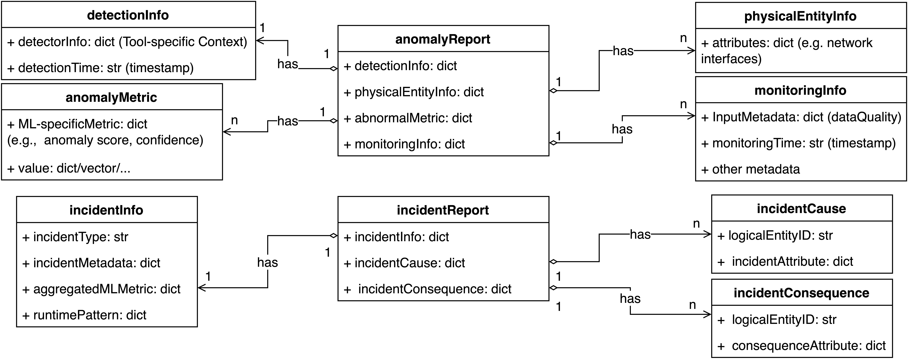
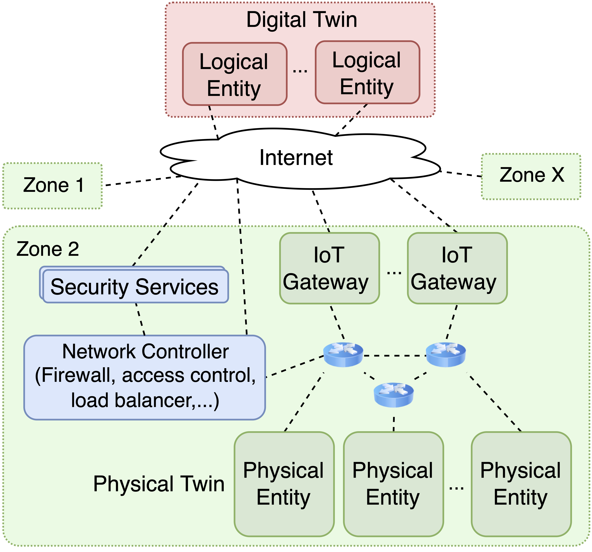
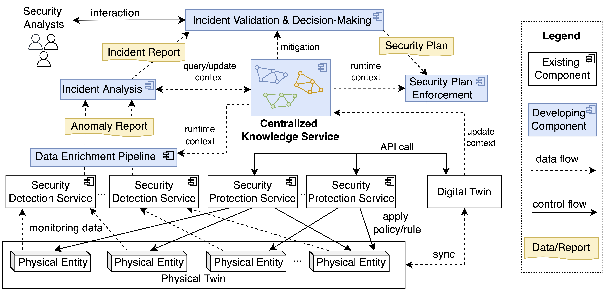

# Explainable Model for Orchestrating ML-based Security Tool for Digital Twin

There is a big growth in using Digital Twins to monitor and optimize systems in the (Industrial) IoT environment (IIoT) or in the digital society in general. 
On the other hand, because security is of paramount importance, such systems may employ many security tools/frameworks, which increasingly adopt machine learning (ML) to automate threat detection and mitigate the consequences. 
It poses new challenges in tool unification (from multi-vendors, data formats) and explainability in security orchestration and response. 
In this study, we want to build an explainable orchestration model by abstracting security reports, including ML-specific attributes, working with different security tools, and providing sufficient information for performance evaluation (by humans in the loop) with less effort. 
Moreover, standardizing security reports and security plans will encourage the security playbook development and integration with ML-based orchestration (continuous learning) and the digital twin's knowledge graph for automating security configuration.

# Explanable Security reports
- To support explainability in security orchestration, we present the report at physical and logical layers to describe the security anomaly detection and security incident. For more details, please refer to the [paper](https://ieeexplore.ieee.org/abstract/document/10633598).

<figure>
<p style="text-align:center">

</p>
<figcaption>
<p style="text-align:center">
Figure 1. Anomaly and Incident reports.
</p>
</figcaption>
</figure>


# Requirement
- Mininet
- Ryu
- QoA4ML
- Numpy
- Pandas

# Experiment
## Run SDN simulation - Producing network data
<figure>
<p style="text-align:center">

</p>
<figcaption>
<p style="text-align:center">
Figure 2. RXOMS Workflow
</p>
</figcaption>
</figure>

- Step run SDN simulation are describe in [SDN Simulation](sdn_simulation/README.md)

## Run RXOMS Services
<figure>
<p style="text-align:center">

</p>
<figcaption>
<p style="text-align:center">
Figure 3. The simulation overview
</p>
</figcaption>
</figure>

### Data
- The data for the experiment is stored in [data/anomaly_data/all_flow.csv](data/anomaly_data/all_flow.csv), generated by running the SDN simulation.
- The data is generated from multiple ML tools that detect anomaly from 22 network flows in an SDN network. The network traffic is simulated based on traffic of the SINDIT Factory. The anomaly detection is based on two algorithms: Isolation Forest and Local Outlier Factor. Each algorithm is trained for two features: bytes and packets. So, there are 44 models in total.
- The raw message from the controller that contains the network flow data is stored in file [sdn_simulation/ml_detection/raw_message.csv](sdn_simulation/ml_detection/raw_message.csv).
- The network flow data is grouped and normalized in [sdn_simulation/ml_detection/flow_data](sdn_simulation/ml_detection/flow_data).
- The python notebook [sdn_simulation/ml_detection/ml_tools.ipynb](sdn_simulation/ml_detection/ml_tools.ipynb) is a simple test that loads the pre-trained models and predicts the anomaly/score for a given flow data. The anomaly detection result is stored in [sdn_simulation/ml_detection/anomal_data](sdn_simulation/ml_detection/anomal_data).

### Running environment
- Python version: 3.12
- The RXOMS library are implemented in the [src/rxoms](src/rxoms) folder. To install the library, navigate to the root RXOMS folder `<...>/RXOMS`
- Run the following command to install the library:
```bash
$ pip install .
```
### Run external services
- RabbitMQ and MongoDB are required to run the Incident Validation and Knowledge Graph services correspondingly. The services can be run in local Docker containers. The configuration of the services is editable at [configuration/service/incident_validation.yaml](configuration/service/incident_validation.yaml) and [configuration/service/simulated_kg.yaml](configuration/service/simulated_kg.yaml).
- The script to run RabbitMQ and MongoDB in Docker containers is provided in the [services/start_external_service.sh](services/start_external_service.sh).

**Note**: the sample login credential for local MongoDB is saved in [configuration/service/db_credential.yaml](configuration/service/db_credential.yaml). Do not commit your credential to the file.


### Run the Knowledge Graph (KG) service:
- Navigate to the [services](services/) folder
- The configuration of the service is editable at [configuration/service/simulated_kg.yaml](configuration/service/simulated_kg.yaml)
- User must specify `host` and `port` for the service to run, by default, `host` is `0.0.0.0`, `port` is `5000`
```bash
$ python3.12 simulated_KG.py
```

### Run the Data Enrichment service:
- Navigate to the [services](services/) folder with another terminal.
- The configuration of the service is editable at [configuration/service/data_enrichment.yaml](configuration/service/data_enrichment.yaml)
- User must specify `host` and `port` for the service to run, by default, `host` is `0.0.0.0`, `port` is `5001`. The service need to know where is the knowledge graph and incident analysis services, so the user must specify the `kg_url` and `ia_url` in the configuration file. By default `kg_url` is `http://localhost:5000` and `ia_url` is `http://localhost:5002`.
```bash
$ python3.12 data_enrichment.py
```

### Run the Incident Analysis service:
- Navigate to the [services](services/) folder with another terminal.
- The configuration of the service is editable at [configuration/service/incident_analysis.yaml](configuration/service/incident_analysis.yaml)
- User must specify `host` and `port` for the service to run, by default, `host` is `0.0.0.0`, `port` is `5002`. The service need to know where is the knowledge graph and incident validation services, so the user must specify the `kg_url` and `iv_url` in the configuration file. By default `kg_url` is `http://localhost:5000` and `iv_url` is `http://localhost:5003`.
- Additionally, physical and logical reports are saved in [data/rxoms_reports](data/rxoms_reports) folder. To disable saving physical reports, set `log_physical_report` to `False` in the configuration file.
```bash
$ python3.12 incident_analysis.py
```
- The incident analysis service will also send the incident reports to the message queue (RabbitMQ). To consume the message, you can run the [services/collector.py](services/collector.py) script.

### Run the Incident Validation service:
- Navigate to the [services](services/) folder with another terminal.
- The configuration of the service is editable at [configuration/service/incident_validation.yaml](configuration/service/incident_validation.yaml)
- User must specify `host` and `port` for the service to run, by default, `host` is `0.0.0.0`, `port` is `5003`. The service need to know where is the knowledge graph and plan enforcement services, so the user must specify the `kg_url` and `pe_url` in the configuration file. By default `kg_url` is `http://localhost:5000` and `pe_url` is `http://localhost:5004`.
```bash
$ python3.12 incident_validation.py
```

### Run the Plan Enforcement service:
- Navigate to the [services](services/) folder with another terminal.
- The configuration of the service is editable at [configuration/service/plan_enforcement.yaml](configuration/service/plan_enforcement.yaml)
- User must specify `host` and `port` for the service to run, by default, `host` is `0.0.0.0`, `port` is `5003`. The service need to know where is the knowledge graph service, so the user must specify the `kg_url` in the configuration file. By default `kg_url` is `http://localhost:5000`.
```bash
$ python3.12 plan_enforcement.py
```
### Run simple test
- The test is provided in a notebook [experiment/test.ipynb](experiment/test.ipynb). The notebook contains a test for all APIs of the Knowledge Graph services and 2 tests for sending network anomaly detection to the whole pipeline. The instruction to run the test is provided in the notebook.

## Reference

If you use the RXOMS library, you can cite

```
@inproceedings{nguyen2024security,
  title={Security Orchestration with Explainability for Digital Twins-based Smart Systems},
  author={Nguyen, Minh-Tri and Lam, An Ngoc and Nguyen, Phu and Truong, Hong-Linh},
  booktitle={2024 IEEE 48th Annual Computers, Software, and Applications Conference (COMPSAC)},
  pages={1194--1203},
  year={2024},
  organization={IEEE}
}
```


## Authors/Contributors

- Minh-Tri Nguyen 
- Hong-Linh Truong 
- Anh-Dung Nguyen
- Hong-Tri Nguyen
- An Ngoc Lam
- Phu Nguyen

**Contact**: Minh-Tri Nguyen (tri.m.nguyen@aalto.fi)

## License

[Apache License](./LICENSE)