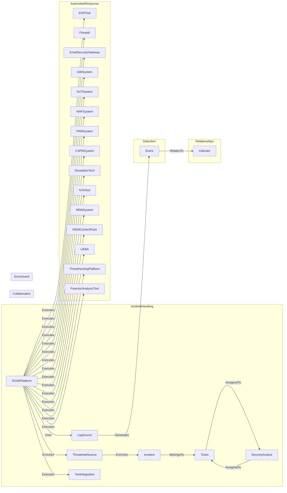

# SOAR Automation Entities and Relationships

## Logical Representation of a SOAR System:

### Entities:

1. **Incident:**
    - Represents a security incident that requires investigation and response.
2. **Security Analyst:**
    - Represents a human security analyst responsible for analyzing and responding to incidents.
3. **SOAR Platform:**
    - The central orchestration and automation platform integrates with various security tools.
4. **Ticketing System:**
    - Used for incident tracking and management.
5. **Threat Intelligence Platform (TIP):**
    - Stores and manages threat intelligence data.
6. **SIEM System:**
    - Collects, correlates, and analyzes security events from various sources.
7. **Endpoint Detection and Response (EDR) Tool:**
    - Monitors and responds to activities on endpoints.
8. **Firewall/IPS:**
    - Monitors and controls network traffic.
9. **Email Security Gateway:**
    - Protects against email-based threats.
10. **Vulnerability Management Tool:**
    - Identifies and manages vulnerabilities in the environment.
11. **Communication Tools:**
    - Facilitates communication and collaboration among security analysts.

### Relationships:

- **Logs (1:N) - SOAR Platform to SIEM, EDR, Firewall, Email Security, etc.:**
    - The SOAR platform collects and integrates logs from various security tools.
- **Correlates (1:N) - SOAR Platform to SIEM:**
    - Correlation of events and incidents within the SIEM system.
- **Enriches (1:N) - SOAR Platform to Threat Intelligence Platform:**
    - The SOAR platform enriches incidents with threat intelligence.
- **Queries (1:N) - SOAR Platform to Vulnerability Management Tool:**
    - The SOAR platform queries vulnerability data for relevant incidents.
- **Automates (1:N) - SOAR Platform to EDR, Firewall, Email Security, etc.:**
    - The SOAR platform automates responses based on playbooks and incident context.
- **Creates (1:N) - Security Analyst to Ticketing System:**
    - Security analysts create and manage tickets for incident tracking.
- **Communicates (M:N) - Security Analyst to Communication Tools:**
    - Security analysts collaborate and communicate using designated tools.

## Security Analyst Workflow:

1. **Incident Detection:**
    - Events are detected by various security tools, such as SIEM, EDR, Firewall, and Email Security.
2. **SOAR Integration:**
    - Events are sent to the SOAR platform, which correlates, enriches, and creates incidents.
3. **Alert Prioritization:**
    - The SOAR platform prioritizes incidents based on severity and threat intelligence.
4. **Analyst Review:**
    - Security analysts review incidents using the SOAR platform's unified interface.
5. **Investigation:**
    - Analysts perform investigations by drilling down into incident details, including log data and enriched threat intelligence.
6. **Collaboration:**
    - Analysts collaborate using communication tools to discuss and share insights.
7. **Automated Response:**
    - The SOAR platform executes automated response actions based on predefined playbooks.
8. **Manual Response:**
    - Analysts manually respond to certain incidents, taking additional actions as needed.
9. **Ticketing and Reporting:**
    - Incidents are tracked in the ticketing system for documentation and reporting purposes.

## **Gartner-Recognized Tools:**
Here are some examples from the industry regarding various tools that constitute a SOC tool stack
- **SOAR Platforms:**
    - Phantom (acquired by Splunk), Swimlane, Palo Alto Networks Cortex XSOAR.
- **SIEM Systems:**
    - Splunk, IBM QRadar, LogRhythm.
- **EDR Tools:**
    - CrowdStrike, Carbon Black (VMware), SentinelOne.
- **Firewalls:**
    - Palo Alto Networks, Cisco Firepower, Fortinet.
- **Email Security:**
    - Proofpoint, Mimecast, Cisco Email Security.
- **Vulnerability Management:**
    - Qualys, Tenable, Rapid7.
- **Communication Tools:**
    - Slack, Microsoft Teams, Cisco Webex Teams.

```mermaid
graph LR
  subgraph IncidentHandling
    Incident -->|Initiates| SOARPlatform
    SOARPlatform -->|Correlates| SIEMSystem
    SOARPlatform -->|Enriches| ThreatIntelPlatform
    SOARPlatform -->|Queries| VulnerabilityManagementTool
    SOARPlatform -->|Automates| EDRTool
    SOARPlatform -->|Automates| Firewall
    SOARPlatform -->|Automates| EmailSecurityGateway
    SOARPlatform -->|Automates| IAMSystem
    SOARPlatform -->|Automates| DLPSystem
    SOARPlatform -->|Automates| WAFSystem
    SOARPlatform -->|Automates| PAMSystem
    SOARPlatform -->|Automates| CSPMSystem
    SOARPlatform -->|Automates| DeceptionTech
    SOARPlatform -->|Automates| NTATool
    SOARPlatform -->|Automates| MDMSystem
    SOARPlatform -->|Automates| SIEMContentPack
    SOARPlatform -->|Automates| UEBA
    SOARPlatform -->|Automates| ThreatHuntingPlatform
    SOARPlatform -->|Automates| ForensicAnalysisTool
    SOARPlatform -->|Creates| TicketingSystem
  end

  subgraph Collaboration
    SecurityAnalyst -->|Creates| TicketingSystem
    SecurityAnalyst -->|Communicates| CommunicationTools
  end

  subgraph Detection
    SIEMSystem -->|Logs| SOARPlatform
    EDRTool -->|Logs| SOARPlatform
    Firewall -->|Logs| SOARPlatform
    EmailSecurityGateway -->|Logs| SOARPlatform
    IAMSystem -->|Logs| SOARPlatform
    DLPSystem -->|Logs| SOARPlatform
    WAFSystem -->|Logs| SOARPlatform
    PAMSystem -->|Logs| SOARPlatform
    CSPMSystem -->|Logs| SOARPlatform
    DeceptionTech -->|Logs| SOARPlatform
    NTATool -->|Logs| SOARPlatform
    MDMSystem -->|Logs| SOARPlatform
    SIEMContentPack -->|Logs| SOARPlatform
    UEBA -->|Logs| SOARPlatform
    ThreatHuntingPlatform -->|Logs| SOARPlatform
    ForensicAnalysisTool -->|Logs| SOARPlatform
  end

  subgraph GartnerTools
    SOARPlatform -->|Leverages| Phantom
    SOARPlatform -->|Leverages| Swimlane
    SOARPlatform -->|Leverages| CortexXSOAR
    SIEMSystem -->|Uses| Splunk
    SIEMSystem -->|Uses| IBMQRadar
    EDRTool -->|Uses| CrowdStrike
    EDRTool -->|Uses| CarbonBlack
    Firewall -->|Uses| PaloAltoNetworks
    Firewall -->|Uses| CiscoFirepower
    EmailSecurityGateway -->|Uses| Proofpoint
    EmailSecurityGateway -->|Uses| Mimecast
    VulnerabilityManagementTool -->|Uses| Qualys
    VulnerabilityManagementTool -->|Uses| Tenable
    IAMSystem -->|Uses| Okta
    IAMSystem -->|Uses| AzureAD
    DLPSystem -->|Uses| SymantecDLP
    DLPSystem -->|Uses| McAfeeDLP
    WAFSystem -->|Uses| Imperva
    PAMSystem -->|Uses| CyberArk
    CSPMSystem -->|Uses| AWSConfig
    DeceptionTech -->|Uses| TrapX
    NTATool -->|Uses| Darktrace
    MDMSystem -->|Uses| MobileIron
    SIEMContentPack -->|Uses| QRadarContentPack
    UEBA -->|Uses| Exabeam
    ThreatHuntingPlatform -->|Uses| Sqrrl
    ForensicAnalysisTool -->|Uses| EnCase
    CommunicationTools -->|Uses| Slack
    CommunicationTools -->|Uses| MicrosoftTeams
  end

  subgraph AnalystWorkflow
    subgraph "Security Analyst"
      SecurityAnalyst -->|Reviews| SOARPlatform
      SecurityAnalyst -->|Investigates| SOARPlatform
      SecurityAnalyst -->|Collaborates| CommunicationTools
      SecurityAnalyst -->|Manually Responds| SOARPlatform
    end
  end

  subgraph AutomatedResponse
    SOARPlatform -->|Executes| EDRTool
    SOARPlatform -->|Executes| Firewall
    SOARPlatform -->|Executes| EmailSecurityGateway
    SOARPlatform -->|Executes| IAMSystem
    SOARPlatform -->|Executes| DLPSystem
    SOARPlatform -->|Executes| WAFSystem
    SOARPlatform -->|Executes| PAMSystem
    SOARPlatform -->|Executes| CSPMSystem
    SOARPlatform -->|Executes| DeceptionTech
    SOARPlatform -->|Executes| NTATool
    SOARPlatform -->|Executes| MDMSystem
    SOARPlatform -->|Executes| SIEMContentPack
    SOARPlatform -->|Executes| UEBA
    SOARPlatform -->|Executes| ThreatHuntingPlatform
    SOARPlatform -->|Executes| ForensicAnalysisTool
  end

```

## SOAR Knowledge Graph 
### Entity Schemas:

Here are some of the entities that compris a SOAR, this list is not exhaustive:
1. **Incident:**
    - Attributes: IncidentID, Description, Status, Severity, Timestamp, CorrelationID, PlaybookID, Resolution, etc.
2. **Event:**
    - Attributes: EventID, Timestamp, SourceIP, DestinationIP, Protocol, EventType, LogSourceID, etc.
3. **Log Source:**
    - Attributes: LogSourceID, Name, Type, Configuration, ToolVendor, etc.
4. **SOAR Platform:**
    - Attributes: SOARPlatformID, Name, Version, Configuration, ToolVendor, etc.
5. **Security Analyst:**
    - Attributes: AnalystID, Name, Role, Skills, etc.
6. **Ticket:**
    - Attributes: TicketID, IncidentID, Summary, Description, Status, Assignee, Timestamp, etc.
7. **Threat Intelligence Source:**
    - Attributes: ThreatIntelSourceID, Name, Type, Configuration, ToolVendor, etc.
8. **Indicator:**
    - Attributes: IndicatorID, Type, Value, Timestamp, ThreatLevel, etc.
9. **Tool Integration:**
    - Attributes: IntegrationID, Name, Type, Configuration, Vendor, etc.

## **Relationships:**

- **Generates (1:N) - Log Source to Event:**
    - A log source generates multiple events, but an event is generated by one log source.
- **Logs (1:N) - Event to Log Source:**
    - An event is logged by one log source, but a log source may log multiple events.
- **Uses (1:N) - SOAR Platform to Log Source:**
    - A SOAR platform uses multiple log sources, but a log source is used by one SOAR platform.
- **BelongsTo (1:N) - Incident to Ticket:**
    - An incident belongs to one ticket, but a ticket may be associated with multiple incidents.
- **AssignedTo (M:N) - Ticket to Security Analyst:**
    - A ticket can be assigned to multiple security analysts, and a security analyst may be assigned multiple tickets.
- **Enriches (1:N) - SOAR Platform to Threat Intel Source:**
    - A SOAR platform enriches incidents with information from multiple threat intelligence sources.
- **RelatesTo (M:N) - Event to Indicator:**
    - An event relates to multiple indicators, and an indicator can be related to multiple events.
- **Executes (1:N) - SOAR Platform to Tool Integration:**
    - A SOAR platform executes actions through multiple tool integrations, but each integration is executed by one SOAR platform.

### Knowledge Graph - Mermaid Diagram:

